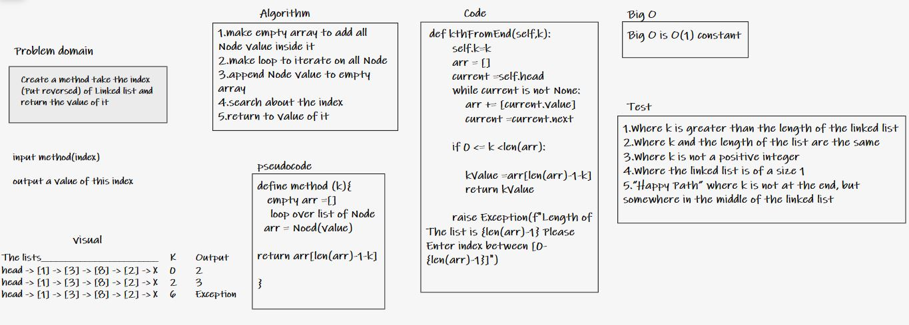

### Singly Linked List

linear data structures, which means that there is a sequence and an order to how they are constructed and traversed .

---
### Challenge

**kth from end argument:** a number, k, as a parameter. Return the node’s value that is k places from the tail of the linked list. You have access to the Node class and all the properties on the Linked List class as well as the methods created in previous challenges.

***Pass on this tests***

Where k is greater than the length of the linked list Where k and the length of the list are the same Where k is not a positive integer Where the linked list is of a size 1 “Happy Path” where k is not at the end, but somewhere in the middle of the linked list

***Approach & Efficiency***
Big O is O(1) constant .

---
### API
[The Code](linked_list/linked.py)

---
### WhiteBord

