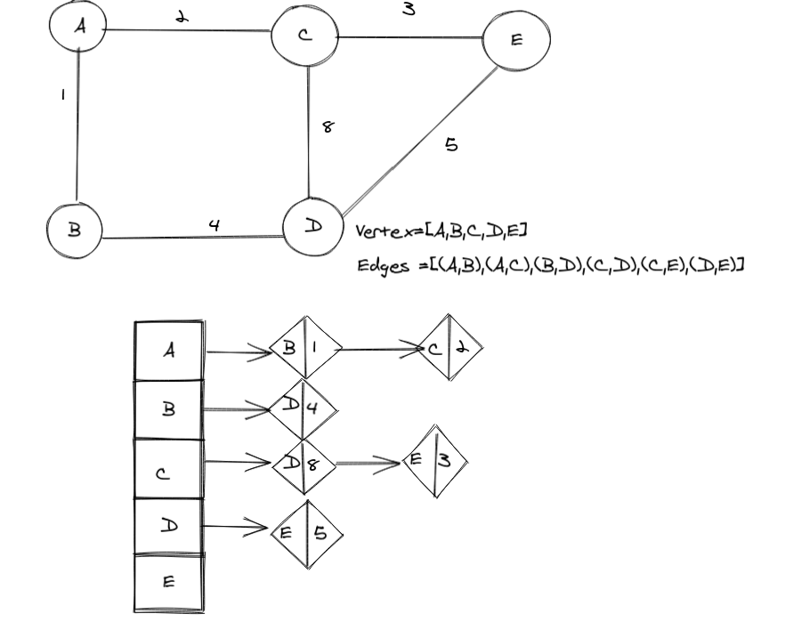

## Graph

---
## Challenge

Implement Graph, The graph should be represented as an adjacency list, and should include the following methods :

- add node
- add edge
- get nodes
- get neighbors
- size

---
## Whiteboard Process

---
## API

***Time :*** O(1)

***Space :*** O(1)

> ***[The Code .....](/python/code_challenges/graph/graph/graph.py)***

> ***[The Tests .....](/python/code_challenges/graph/tests/test_graph.py)***

---
## Check List

- [x] Branch Name : graph .
- [x] Implement Graph, The graph should be represented as an adjacency list, and should include the following methods :
    - [x] add node
    - [x] add edge
    - [x] get nodes
    - [x] get neighbors
    - [x] size
- [x] Top-level README **Table of Content** is updated .
- [x] Feature tasks for this challenge are completed .
- [x] Edge Case ( if applicable / obvious ) .
- [x] README for this challenge is complete .
- [x] Link to code and test .
- [x] Unit tests written and passing .

---
