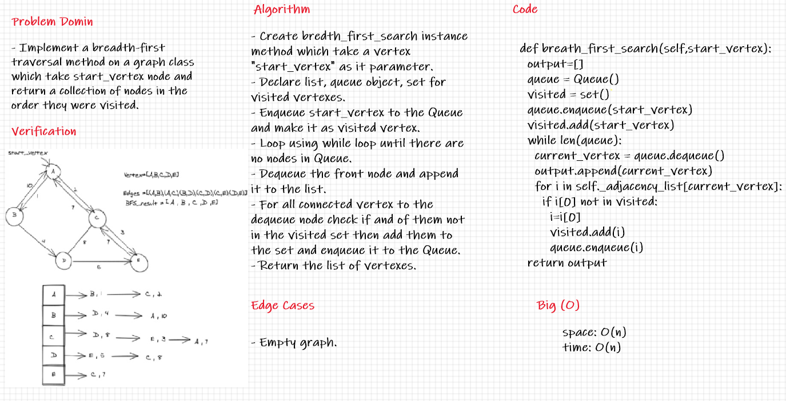

## Graph Breadth First

Breadth First Traversal On a Graph Implementation .

---
## Challenge

- Write the following method for the Graph class :
    - Breadth first .
    - Arguments: Node .
    - Return: A collection of nodes in the order they were visited .
    - Display the collection .

---
## Whiteboard Process

---
## API

***Time :*** O(V+E)

***Space :*** O(n)

> ***[The Code .....](/python/code_challenges/hash_table/hash_table/hash.py)***

> ***[The Tests .....](/python/code_challenges/hash_table/tests/test_hash_table.py)***
---
## Check List

- [x] Branch Name : graph-breadth-first .
- [x] - Write the following method for the Graph class :
    - [x] Breadth first .
    - [x] Arguments: Node .
    - [x] Return: A collection of nodes in the order they were visited .
    - [x] Display the collection .
- [x] Top-level README **Table of Content** is updated .
- [x] Feature tasks for this challenge are completed .
- [x] Unit tests written and passing .
- [x] Edge Case ( if applicable / obvious ) .
- [x] README for this challenge is complete .
- [x] Link to code and test .

---
