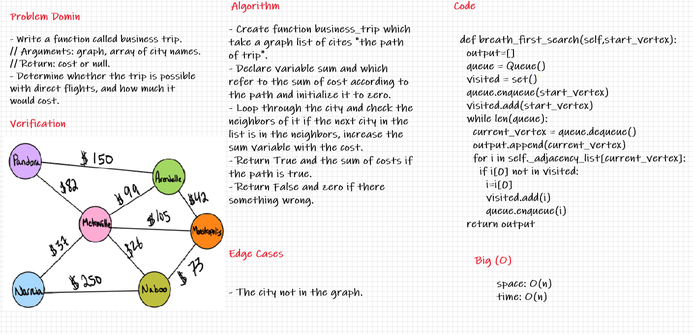

## Graph Business Trip

---
## Challenge

Write a function called business trip. - Arguments: graph, array of city names. - Return: cost or null, Determine whether the trip is possible with direct flights, and how much it would cost .

---
## Whiteboard Process

---
## API

***Time :*** O(n)

***Space :*** O(1)

> ***[The Code .....](/python/code_challenges/graph/graph/graph.py)***

> ***[The Tests .....](/python/code_challenges/graph/tests/test_graph.py)***
---
## Check List

- [x] Branch Name : graph-business-trip .
- [x] Write a function called business trip. - Arguments: graph, array of city names. - Return: cost or null, Determine whether the trip is possible with direct flights, and how much it would cost .
- [x] Top-level README **Table of Content** is updated .
- [x] Feature tasks for this challenge are completed .
- [x] Unit tests written and passing .
- [x] Edge Case ( if applicable / obvious ) .
- [x] README for this challenge is complete .
- [x] Link to code and test .

---
