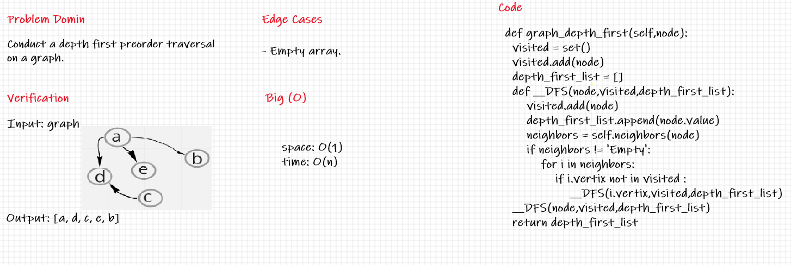

## Graph Depth First

---
## Challenge

- Write the following method for the Graph class :
    - Name: Depth first .
    - Arguments: Node (Starting point of search) .
    - Return: A collection of nodes in their pre-order depth-first traversal order .
    - Program output: Display the collection .

---
## Whiteboard Process

---
## API

***Time :*** O(n)

***Space :*** O(1)

> ***[The Code .....](/python/code_challenges/graph/graph/graph.py)***

> ***[The Tests .....](/python/code_challenges/graph/tests/test_graph.py)***
---
## Check List

- [x] Branch Name : graph-depth-first .
- [x] Write the following method for the Graph class :
    - Name: Depth first .
    - Arguments: Node (Starting point of search) .
    - Return: A collection of nodes in their pre-order depth-first traversal order .
    - Program output: Display the collection .
- [x] Top-level README **Table of Content** is updated .
- [x] Feature tasks for this challenge are completed .
- [x] Unit tests written and passing .
- [x] Edge Case ( if applicable / obvious ) .
- [x] README for this challenge is complete .
- [x] Link to code and test .

---
