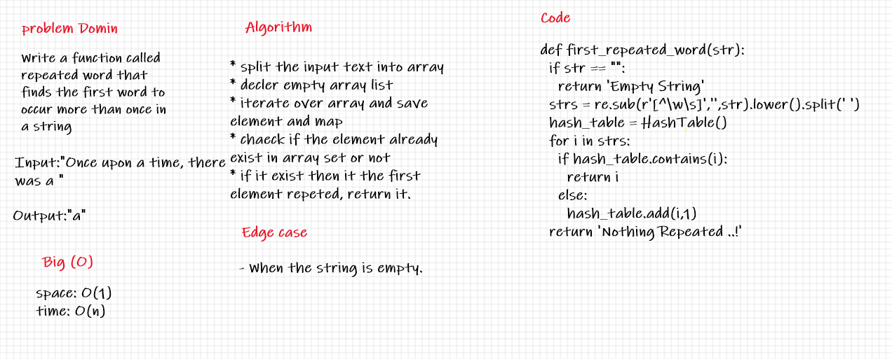

## Hash Taple Repeated Word

Find the first repeated word in a sentence .

---
## Challenge

Write a function that accepts a lengthy string parameter, Without utilizing any of the built-in library methods available to your language, return the first word to occur more than once in that provided string .

---
## Whiteboard Process

---
> ***[The Code .....](/python/code_challenges/hash_table/hash_table/hash.py)***

> ***[The Tests .....](/python/code_challenges/hash_table/tests/test_hash_table.py)***

---
## Check List

- [x] Branch Name : hashmap-repeated-word .
- [x] Write a function called repeated word that finds the first word to occur more than once in a string
    - Arguments: string
    - Return: string
- [x] Top-level README **Table of Content** is updated.
- [x] Feature tasks for this challenge are completed.
- [x] Unit tests written and passing.
- [x] Edge Case ( if applicable / obvious ).
- [x] README for this challenge is complete.
- [x] Link to code and test .

---
