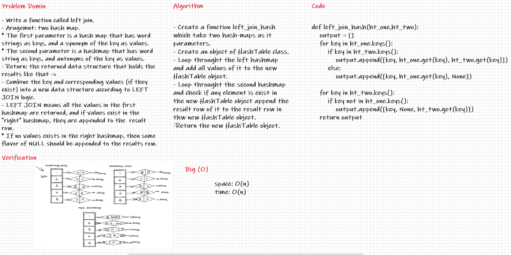

## Hashmap Left Join

Implement a simplified **LEFT JOIN** for Two Hashmaps .

---
## Challenge

- Write a function called left join .
- Arguments: two hash maps .
    - The first parameter is a hashmap that has word strings as keys, and a synonym of the key as values .
    - The second parameter is a hashmap that has word strings as keys, and antonyms of the key as values .
- Return: The returned data structure that holds the results like that :
    - Combine the key and corresponding values (if they exist) into a new data structure according to LEFT JOIN logic .
    - LEFT JOIN means all the values in the first hashmap are returned, and if values exist in the “right” hashmap, they are appended to the result row .
    - If no values exist in the right hashmap, then some flavor of NULL should be appended to the result row.
---
## Whiteboard Process

---
## API

***Time :*** O(n)

***Space :*** O(n)

> ***[The Code .....](/python/code_challenges/hash_table/hash_table/hash.py)***

> ***[The Tests .....](/python/code_challenges/hash_table/tests/test_hash_table.py)***
---
## Check List

- [x] Branch Name : hashmap-left-join .
- [x] Write a function called left join .
    - [x] Arguments: two hash maps .
      - The first parameter is a hashmap that has word strings as keys, and a synonym of the key as values .
      - The second parameter is a hashmap that has word strings as keys, and antonyms of the key as values .
    - [x] Return: The returned data structure that holds the results like that :
      - Combine the key and corresponding values (if they exist) into a new data structure according to LEFT JOIN logic .
      - LEFT JOIN means all the values in the first hashmap are returned, and if values exist in the “right” hashmap, they are appended to the result row .
      - If no values exist in the right hashmap, then some flavor of NULL should be appended to the result row .
- [x] Top-level README **Table of Content** is updated.
- [x] Feature tasks for this challenge are completed.
- [x] Unit tests written and passing.
- [x] Edge Case ( if applicable / obvious ).
- [x] README for this challenge is complete.
- [x] Link to code and test .

---
