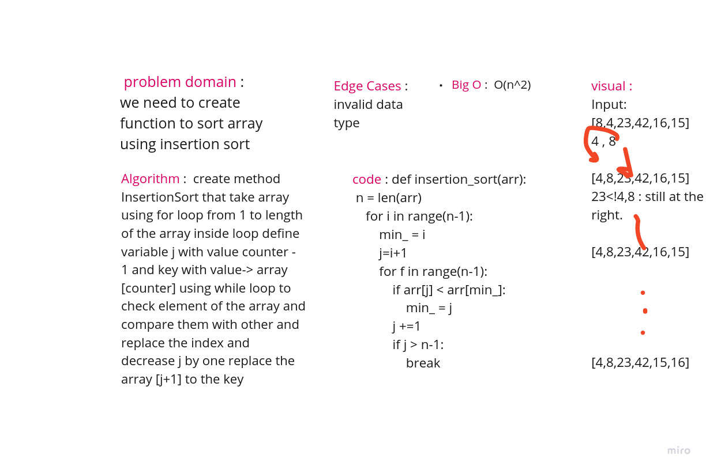

## Insertion Sort

> ***[BLOG.md .....](/python/code_challenges/insertion_sort/BLOG.md)***


Insertion Sort is a sorting algorithm that traverses the array multiple times as it slowly builds out the sorting sequence .

so first of all you get the length of the array

**inside a loop :**

you assign a variable for the index 0

then you assign a variable for the one after

then check which one is bigger and swap their locations if required

---
## Solution

- create method InsertionSort that take array .
- using for loop from 1 to length of the array .
- inside loop define variable j with value counter - 1 and key with value-> array [counter] .
- using while loop to check element of the array and compare them with other and replace the index and decrease j by one .
- replace the array [ j + 1 ] to the key .

---
## example code :

```
def inser_sort(data):
    n = len(data))
    for i in range(n-1):
        min_ = i
        j=i+1
        for f in range(n-1):
            if data)[j] < data)[min_]:
                min_ = j
            j +=1
            if j > n-1:
                break

        temp = data)[min_]
        data)[min_] = data)[i]
        data)[i] = temp
```



---
## API

***Big O O( n^2 )***


> ***[The Code .....](/python/code_challenges/insertion_sort/insertion_sort/sort.py)***

> ***[The Tests .....](/python/code_challenges/insertion_sort/tests/test_insertion_sort.py)***

---
## Check List

- [x] Branch Name : insertion-sort .
- [x] Provide a visual step through for each of the sample arrays based on the provided pseudo code .
- [x] Convert the pseudo-code into working code in your language .
- [x] Present a complete set of working tests .

---
