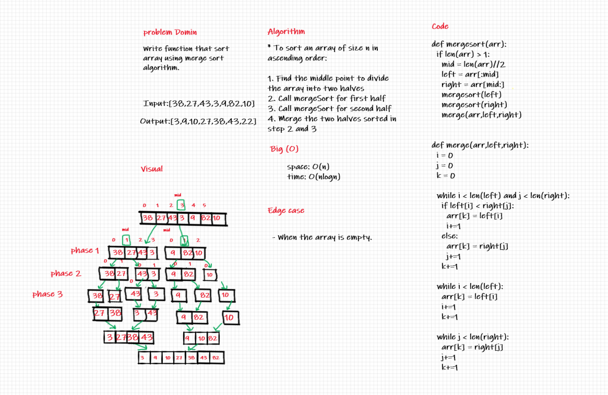

## Marge Sort

> ***[BLOG.md .....](/python/code_challenges/merge-sort/BLOG.md)***

- Merge sort works by splitting the input list into two halves, repeating the process on those halves, and finally merging the two sorted halves together.

---
## Challenge Summary

  - Provide a visual step through for each of the sample arrays based on the provided pseudo code .
  - Convert the pseudo-code into working code in your language .
  - Present a complete set of working tests .

---
## Whiteboard Process

---
## API

  * Time: O(n.logn)
    - Because the list is being split in log(n) calls and the merging process takes linear time in each call.
  * Space: O(1)
    - This list is being sorted in place, keeping the space at constant O(1).

> ***[The Code .....](/python/code_challenges/merge-sort/merge_sort/merge.py)***

> ***[The Tests .....](/python/code_challenges/merge-sort/tests/test_merge_sort.py)***

---
## Check List

- [x] Branch Name : merge-sort .
- [x] Provide a visual step through for each of the sample arrays based on the provided pseudo code .
- [x] Convert the pseudo-code into working code in your language .
- [x] Present a complete set of working tests .
