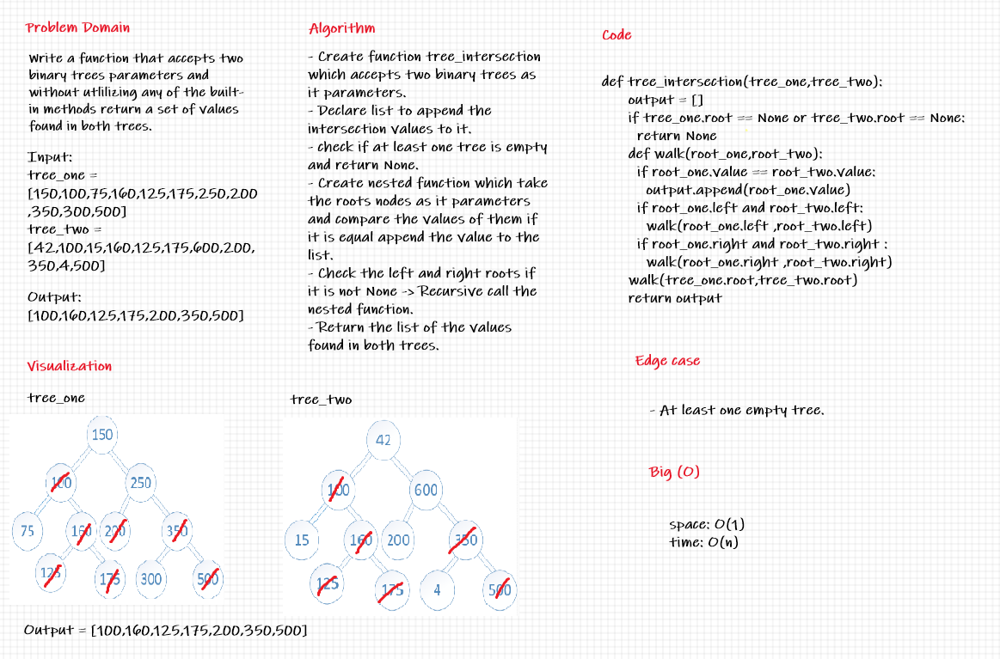

## Tree Intersection

Find common values in Two binary trees .

---
## Challenge

Write a function that accepts a lengthy string parameter, Without utilizing any of the built-in library methods available to your language, return a set of values found in both trees .

---
## Whiteboard Process

---
## API

***Time :*** O(n)

***Space :*** O(1)

> ***[The Code .....](/python/code_challenges/tree_intersection/tree_intersection/tree_intersection.py)***

> ***[The Tests .....](/python/code_challenges/tree_intersection/tests/test_tree_intersection.py)***
---
## Check List

- [x] Branch Name : tree-intersection .
- [x] Write a function called tree_intersection that takes two binary trees as parameters .
- [x] Using your Hashmap implementation as a part of your algorithm, return a set of values found in both trees .
- [x] Top-level README **Table of Content** is updated.
- [x] Feature tasks for this challenge are completed.
- [x] Unit tests written and passing.
- [x] Edge Case ( if applicable / obvious ).
- [x] README for this challenge is complete.
- [x] Link to code and test .

---
